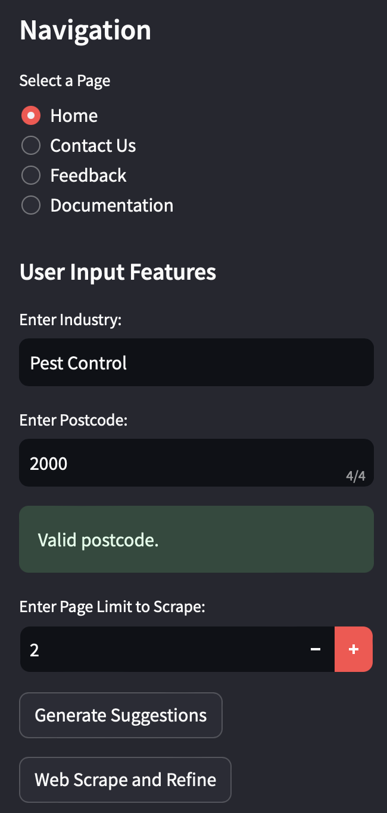

# ABN Lookup Tool


## Table of Contents

1. [Introduction](#introduction)
2. [Interface Guide](#interface-guide)
3. [Future & Limitations](#future--limitations)
4. [Directory Structure](#directory-structure)
5. [License](#license)
6. [Requirements](#requirements)

## Introduction

### Purpose

The ABN Lookup Tool has been developed with the primary objective of simplifying the process of searching, retrieving, and managing business details. It offers a user-friendly interface coupled with robust features to assist users in gathering comprehensive business-related information.

### Framework Architecture

The architecture of the ABN Lookup Tool is modular and designed to provide efficient data retrieval and user interactivity.


### Example data

```
| ABN         | Identifier Status | Organisation Name      | Score | Is Current Indicator | State Code | Postcode |
|-------------|-------------------|------------------------|-------|----------------------|------------|----------|
| 46103449985 | Active            | PERMANENT PEST CONTROL | 94    | Y                    | NSW        | 2000     |
| 25618786968 | Active            | Proven Pest Control    | 94    | Y                    | NSW        | 2000     |
[... More Rows ...]
```

#### More about the columns:

- **ABN (Australian Business Number)**: The ABN is a unique 11-digit identifier issued by the Australian government to identify businesses operating in Australia. This column contains the ABNs of various entities, such as businesses and organisations.
  
- **Identifier Status**: This column indicates the status of the ABN, which can be "Active" or "Cancelled." An "Active" status means that the business or organisation is currently operating and registered, while a "Cancelled" status suggests that the registration may have been terminated.
  
- **Organisation Name**: The organisation name is represented as the legal name or trading name of the entity associated with the ABN. This column contains the full name of the organisation or individual related to the ABN.
  
- **Score**: The score here represents a measure of relevance or accuracy of the search results. A higher score indicates a closer match to the search query or keywords. It helps assess the quality of the search results, with higher scores generally being more relevant.
  
- **Is Current Indicator**: This column contains a binary indicator ("Y" or "N") that signifies whether the entity's information is current or not. If it's marked as "Y," it means that the data is up-to-date and applicable, while "N" suggests that the information may be outdated or no longer valid.
  
- **State Code**: The state code represents the Australian state or territory associated with the entity's physical address. This column provides information about the state or territory in which the entity is located, such as New South Wales (NSW).
  
- **Postcode**: The postcode column contains the postal code or ZIP code related to the entity's physical address. It specifies the area or region where the entity is situated, helping to pinpoint its location within a state or territory.

### Additional Features

- **Search and Explore Businesses**: Users can search businesses using either the ABN or Organisation Name. The resulting dataframe (`display_df`) displays the following columns: ABN, Identifier Status, Organisation Name, Score, Is Current Indicator, State Code, and Postcode.

- **Sort and Fullscreen View**: Users can sort the table by clicking on a column name and view the table in fullscreen for detailed exploration.
  
- **CSV & Excel Download**: Users can download the search results in CSV or Excel format for future reference.
  
- **Postcode Specification**: Refine your search by specifying a postcode (NSW Only) to narrow down the results to a particular location.

- **Session State Management**: The app preserves the state of the home page even when navigating to other pages, ensuring a consistent user experience.

- **Contact Us**: Users are provided with a direct line of communication (Name, Email, Address) for any inquiries, suggestions, or further communications.

- **Feedback**: Users can share their thoughts and feedback via our integrated Google Forms, ensuring a straightforward and efficient submission process while keeping all responses systematically organised.

- **Editing & Updating**: List updates or edits (out of all three) are automatically and dynamically reflected in other relevant lists through a feedback system.

## Interface Guide

To make the most out of the ABN Lookup Tool, here's a step-by-step guide to navigate through its features, complemented with interface screenshots for clarity.

1. **Startup & Main Page**: Upon launching the tool, you're greeted with the main interface.


2. **Entering Industry Details**: Start by specifying your industry of interest, desired postcode, and setting the page limit.



3. **Generating Suggestions & Web Scraping**: After filling the initial details, generate business name suggestions and further refine them through web scraping.


4. **Exploring Businesses**: Post-refinement, explore the businesses based on the refined suggestions and download the data.


5. **Feedback & Contact Us Pages**: Navigate to these sections to provide feedback or get in touch with the team.


## Future & Limitations

### Current Limitations:

- **Geographical Restriction**: The postcode specification currently supports only NSW. Expansion to other regions can make the tool more versatile.
- **Data Source Dependency**: The data is sourced mainly from YellowPages and ABN Lookup website, which might not cover all available businesses.
- **Data Accuracy**: As with all web scraping methods, there's always a small chance of discrepancies in the data retrieved.
- **Keyword Refinement**: Although, final suggestions can be edited, keywords refinement solely depends on GPT-4 API.

### Future Improvements:

- **Expanding Geographical Coverage**: Integration of more regions beyond NSW.
- **Incorporating More Data Sources**: Including more sources can improve the diversity and accuracy of business data.
- **Improve Refinement Process**: Improve the refinement process of keywords related to the business names of the industry defined.
- **User Profile Management**: Allow users to create profiles, save searches, and manage their lookup histories.
- **Feedback Analytics**: Implement an analytics system to derive insights from user feedback and drive future improvements.

## Directory Structure
```
ABN_LOOKUP_TOOL/
|-- pycache
|-- Visualisations
|-- ABN Lookup Tool Architecture.png
|-- abn_data.xIsx
|-- ABN_Lookup.ipynb
|-- abnlookup.py
|-- App icon.png
|-- app_testing.py
|-- app.py
|-- Cover image.png
|-- EXtras.ipynb
|-- keywordgen.py
|-- LICENSE
|-- output.xml
|-- README.md
|-- requirements.txt
|-- screenshot_contact_feedback.png
|-- screenshot_explore.png
|-- screenshot_industry.png
|-- screenshot_startup.png
|-- screenshot_suggestions.png
|-- webscrapping.py
```

## License

This project is licensed under the terms of the provided license file.

## Requirements

To run this project, you need to have the following:

- Python 3.8 or higher
- Libraries: Streamlit, Pandas, Numpy, OpenAI API, BeautifulSoup, and Requests.
- A working internet connection to access the ABN Lookup website and other data sources.